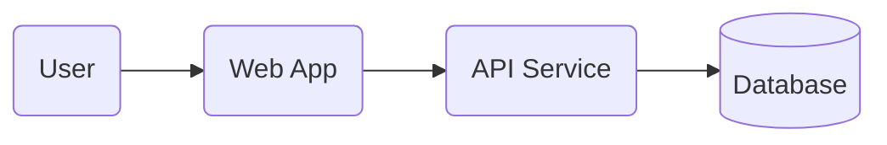

# Architecture Overview

> Keep this as a living, high-level model. Link to specifics and ADRs.

## System Context

- Users / systems that interact with this project
- Major components and boundaries

## C4-ish Diagram (Mermaid)

## Tech Stack

- See `./tech_stack.md` for the current stack choices, rationale, and tradeoffs.

## Key Decisions

- Documented as ADRs in `./decisions/`.

## Interfaces & Contracts

- Public APIs:
- Events / messages:
- Data schema links:

## Operational Concerns

- Deployment:
- Observability:
- Security:
- Data retention:
