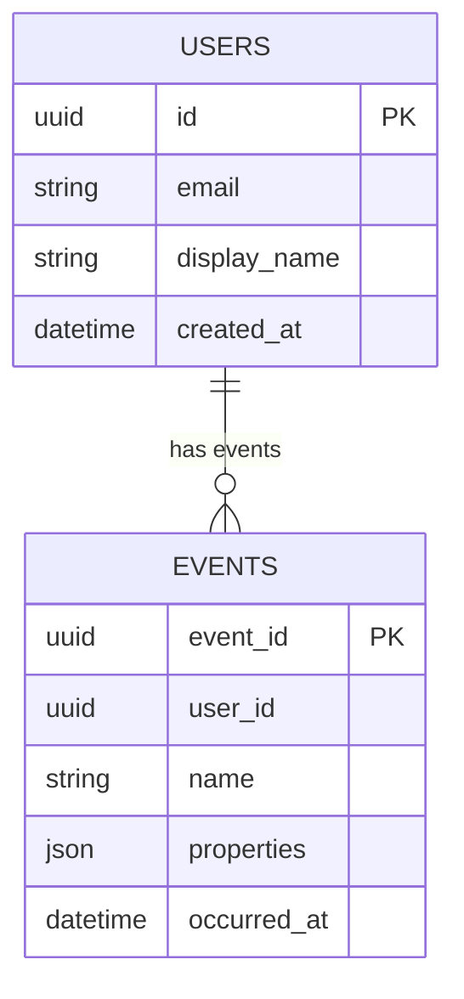

# Entity Relationship Diagram

```mermaid
erDiagram
    USERS {
      uuid id PK
      string email
      string display_name
      datetime created_at
    }

    EVENTS {
      uuid event_id PK
      uuid user_id
      string name
      json properties
      datetime occurred_at
    }

    USERS ||--o{ EVENTS : "has events"
```
