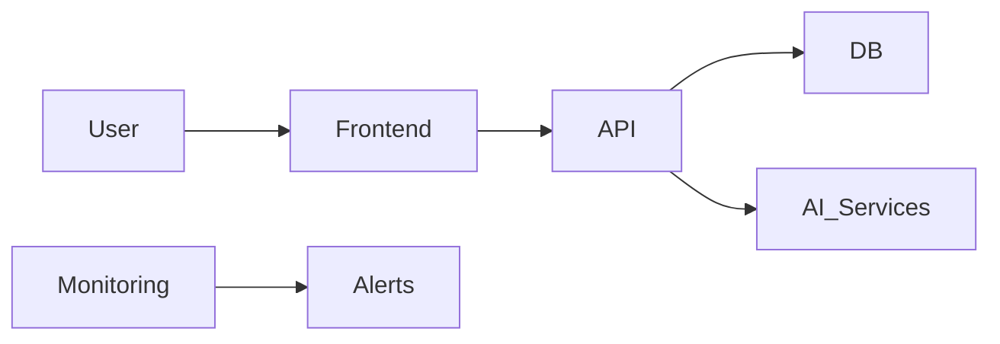

# Tech Stack

> This file captures the selected technologies for each layer, with rationale, tradeoffs, and risks. Generate via `prompts/tech_stack_prompt.md`.

## Tech Stack Overview

| Layer | Options | Choice | Rationale | Pros | Cons | Tradeoffs | Risks / Mitigations | Notes |
|-------|---------|--------|-----------|------|------|-----------|----------------------|-------|
| Frontend |  |  |  |  |  |  |  |  |
| Backend / API |  |  |  |  |  |  |  |  |
| Database |  |  |  |  |  |  |  |  |
| Auth |  |  |  |  |  |  |  |  |
| File/Blob Storage |  |  |  |  |  |  |  |  |
| Queue/Events |  |  |  |  |  |  |  |  |
| Infra/Hosting |  |  |  |  |  |  |  |  |
| Observability |  |  |  |  |  |  |  |  |
| CI/CD |  |  |  |  |  |  |  |  |
| Testing |  |  |  |  |  |  |  |  |

## Architecture Overview

## ADRs to Draft

- (add ADR titles here)
